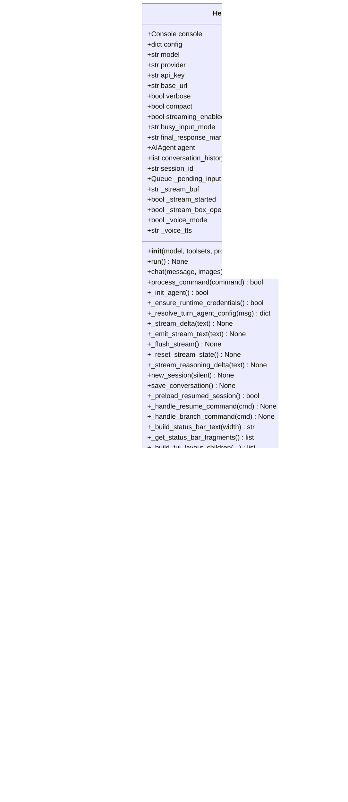
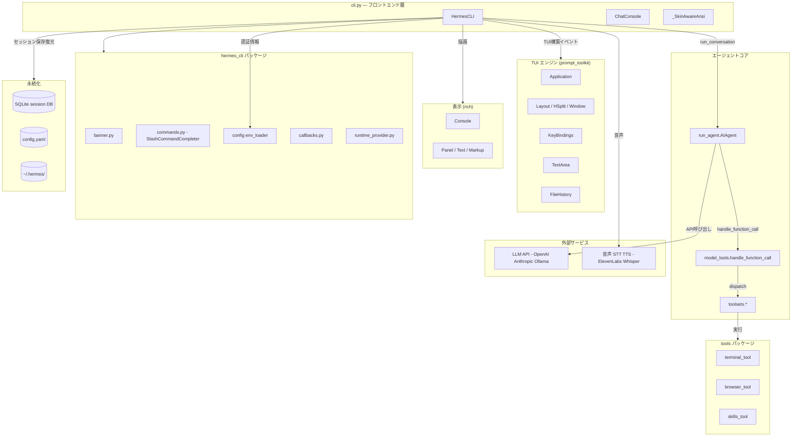
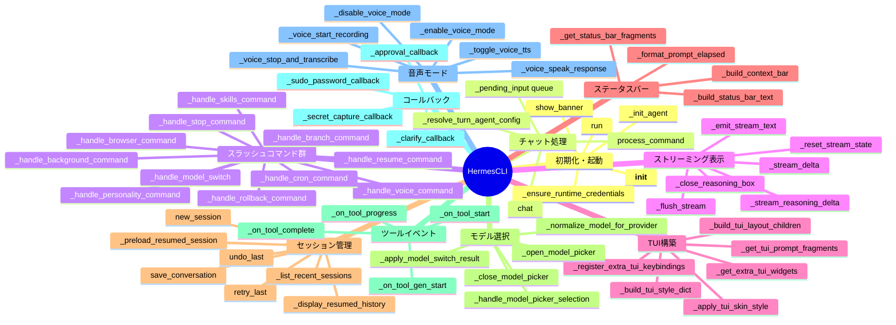
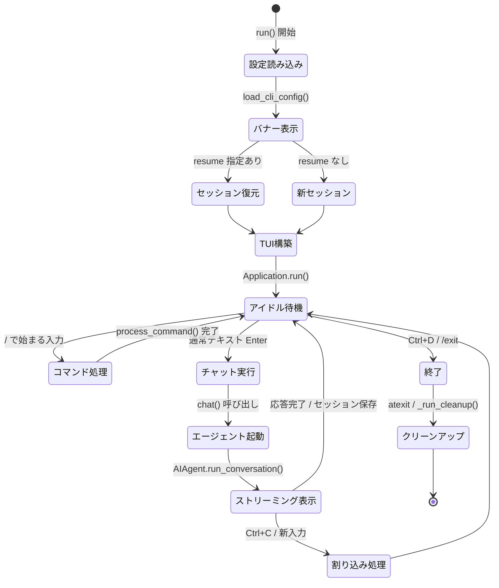

# cli.py 解析図

---

## 1. クラス図

cli.py に存在するクラスと相互関係。

```mermaid
classDiagram
    class _SkinAwareAnsi {
        -str skin_key
        -str fallback_hex
        -bool bold
        -str _cached_hex
        +__str__() str
        +__add__(other) str
        +__radd__(other) str
        +reset() None
    }

    class ChatConsole {
        -Console _rich_console
        +print(*args, **kwargs) None
        +status(*args, **kwargs) contextmanager
    }

    class HermesCLI {
        +Console console
        +dict config
        +str model
        +str provider
        +str api_key
        +str base_url
        +bool verbose
        +bool compact
        +bool streaming_enabled
        +str busy_input_mode
        +str final_response_markdown
        +AIAgent agent
        +list conversation_history
        +str session_id
        +Queue _pending_input
        +str _stream_buf
        +bool _stream_started
        +bool _stream_box_opened
        +bool _voice_mode
        +str _voice_tts

        +__init__(model, toolsets, provider, ...) None
        +run() None
        +chat(message, images) Optional~str~
        +process_command(command) bool

        +_init_agent() bool
        +_ensure_runtime_credentials() bool
        +_resolve_turn_agent_config(msg) dict

        +_stream_delta(text) None
        +_emit_stream_text(text) None
        +_flush_stream() None
        +_reset_stream_state() None
        +_stream_reasoning_delta(text) None

        +new_session(silent) None
        +save_conversation() None
        +_preload_resumed_session() bool
        +_handle_resume_command(cmd) None
        +_handle_branch_command(cmd) None

        +_build_status_bar_text(width) str
        +_get_status_bar_fragments() list
        +_build_tui_layout_children(...) list
        +_get_tui_prompt_fragments() list

        +_handle_model_switch(cmd) None
        +_open_model_picker(...) None
        +_apply_model_switch_result(result, ...) None

        +_on_tool_start(tool_call_id, ...) None
        +_on_tool_complete(tool_call_id, ...) None
        +_on_tool_progress(event_type, ...) None

        +_approval_callback(command, ...) str
        +_sudo_password_callback() str
        +_secret_capture_callback(var_name, ...) None
        +_clarify_callback(question, choices) str

        +_handle_voice_command(command) None
        +_voice_start_recording() None
        +_voice_stop_and_transcribe() None
        +show_help() None
        +show_tools() None
        +show_history() None
    }

    HermesCLI --> ChatConsole : 使用
    HermesCLI --> _SkinAwareAnsi : テーマ色参照
    HermesCLI --> AIAgent : 保持 (self.agent)
```

---

## 2. コンポーネント図（cli.py の依存関係）

```mermaid
flowchart TB
    subgraph CLI["cli.py — フロントエンド層"]
        HC[HermesCLI]
        CC[ChatConsole]
        SA[_SkinAwareAnsi]
    end

    subgraph TUI["TUI エンジン (prompt_toolkit)"]
        APP[Application]
        LAYOUT[Layout / HSplit / Window]
        KB[KeyBindings]
        TA[TextArea]
        HIST[FileHistory]
    end

    subgraph RICH["表示 (rich)"]
        CON[Console]
        PANEL[Panel / Text / Markup]
    end

    subgraph AGENT["エージェントコア"]
        AG[run_agent.AIAgent]
        MT[model_tools.handle_function_call]
        TS[toolsets.*]
    end

    subgraph HCLI["hermes_cli パッケージ"]
        BAN[banner.py]
        CMD[commands.py - SlashCommandCompleter]
        CFG[config env_loader]
        CB[callbacks.py]
        RTP[runtime_provider.py]
    end

    subgraph TOOLS["tools パッケージ"]
        TERM[terminal_tool]
        BROW[browser_tool]
        SKILL[skills_tool]
    end

    subgraph STORE["永続化"]
        DB[(SQLite session DB)]
        YAML[(config.yaml)]
        FILES[(~/.hermes/)]
    end

    subgraph EXT["外部サービス"]
        LLM[LLM API - OpenAI Anthropic Ollama]
        VOICE[音声 STT TTS - ElevenLabs Whisper]
    end

    HC -->|TUI構築イベント| TUI
    HC -->|描画| RICH
    HC -->|run_conversation| AG
    AG -->|handle_function_call| MT
    MT -->|dispatch| TS
    TS -->|実行| TOOLS
    HC --> HCLI
    HC -->|セッション保存復元| STORE
    HC -->|認証情報| CFG
    AG -->|API呼び出し| LLM
    HC -->|音声| VOICE
```

---

## 3. HermesCLI メソッドグループ図

約150個のメソッドを機能ドメイン別に整理。

```mermaid
mindmap
  root((HermesCLI))
    初期化・起動
      __init__
      run
      show_banner
      _init_agent
      _ensure_runtime_credentials
    チャット処理
      chat
      process_command
      _resolve_turn_agent_config
      _pending_input queue
    スラッシュコマンド群
      _handle_model_switch
      _handle_rollback_command
      _handle_stop_command
      _handle_resume_command
      _handle_branch_command
      _handle_background_command
      _handle_browser_command
      _handle_voice_command
      _handle_cron_command
      _handle_skills_command
      _handle_personality_command
    ストリーミング表示
      _stream_delta
      _emit_stream_text
      _flush_stream
      _reset_stream_state
      _stream_reasoning_delta
      _close_reasoning_box
    TUI構築
      _build_tui_layout_children
      _get_tui_prompt_fragments
      _build_tui_style_dict
      _apply_tui_skin_style
      _register_extra_tui_keybindings
      _get_extra_tui_widgets
    ステータスバー
      _build_status_bar_text
      _get_status_bar_fragments
      _build_context_bar
      _format_prompt_elapsed
    セッション管理
      new_session
      save_conversation
      _preload_resumed_session
      _display_resumed_history
      _list_recent_sessions
      retry_last
      undo_last
    モデル選択
      _open_model_picker
      _close_model_picker
      _apply_model_switch_result
      _handle_model_picker_selection
      _normalize_model_for_provider
    ツールイベント
      _on_tool_start
      _on_tool_complete
      _on_tool_progress
      _on_tool_gen_start
    コールバック
      _approval_callback
      _sudo_password_callback
      _secret_capture_callback
      _clarify_callback
    音声モード
      _enable_voice_mode
      _disable_voice_mode
      _toggle_voice_tts
      _voice_start_recording
      _voice_stop_and_transcribe
      _voice_speak_response
```

---

## 4. run() の TUI 起動フロー（状態図）

```mermaid
stateDiagram-v2
    [*] --> 設定読み込み : run() 開始
    設定読み込み --> バナー表示 : load_cli_config()
    バナー表示 --> セッション復元 : resume 指定あり
    バナー表示 --> 新セッション : resume なし
    セッション復元 --> TUI構築
    新セッション --> TUI構築

    TUI構築 --> アイドル待機 : Application.run()

    アイドル待機 --> コマンド処理 : / で始まる入力
    アイドル待機 --> チャット実行 : 通常テキスト Enter
    アイドル待機 --> 終了 : Ctrl+D / /exit

    コマンド処理 --> アイドル待機 : process_command() 完了
    チャット実行 --> エージェント起動 : chat() 呼び出し
    エージェント起動 --> ストリーミング表示 : AIAgent.run_conversation()
    ストリーミング表示 --> アイドル待機 : 応答完了 / セッション保存
    ストリーミング表示 --> 割り込み処理 : Ctrl+C / 新入力
    割り込み処理 --> アイドル待機

    終了 --> クリーンアップ : atexit / _run_cleanup()
    クリーンアップ --> [*]
```
